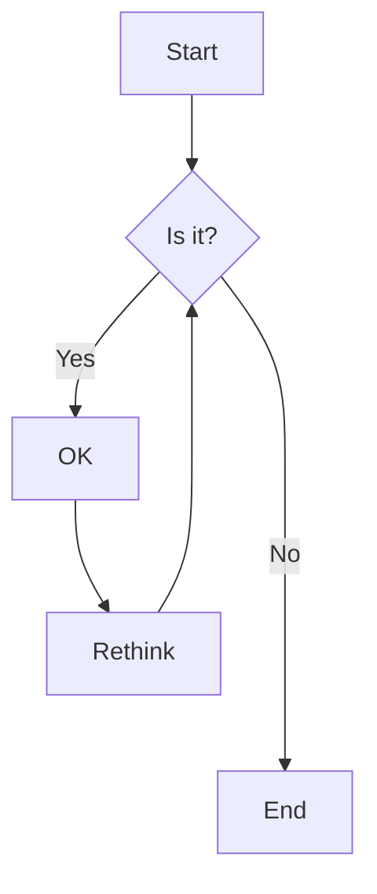
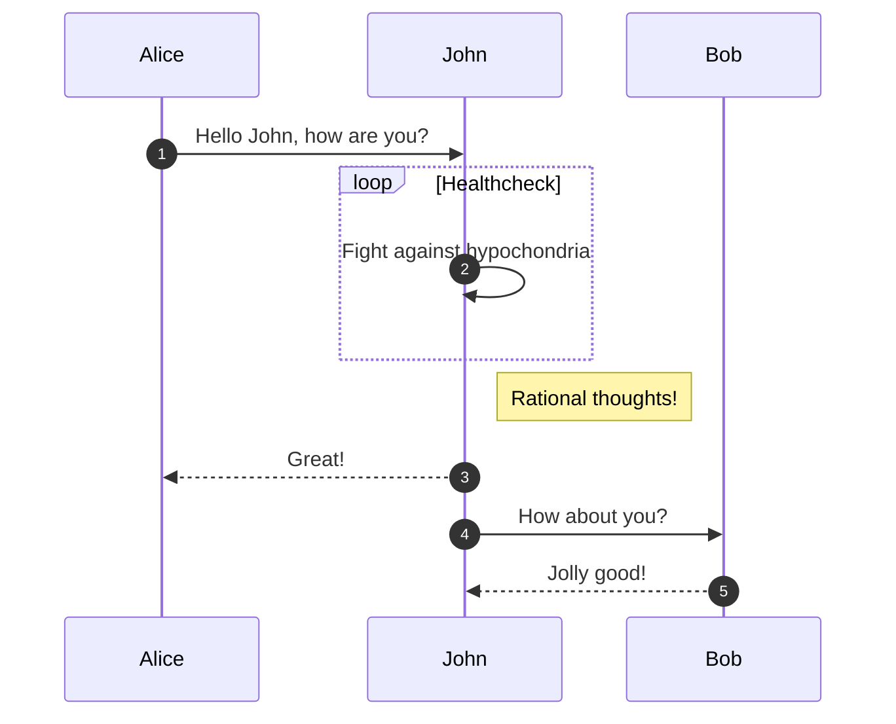
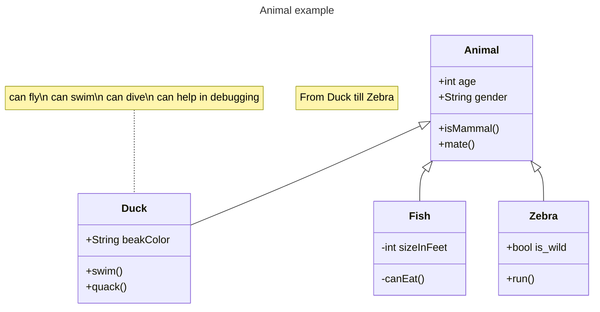

---
tags:
  - mermaid.js
title: Mermaid.js Chart
author: Huy Nguyen
pubDatetime: 2024-01-06T15:57:52.737Z
slug: mermaid-js-chart
featured: false
ogImage: https://user-images.githubusercontent.com/53733092/215771435-25408246-2309-4f8b-a781-1f3d93bdf0ec.png
description: chart example in mermaid js
---

### 1. Flowchart

```bash
flowchart TD
    A[Start] --> B{Is it?}
    B -- Yes --> C[OK]
    C --> D[Rethink]
    D --> B
    B -- No ----> E[End]
```



### 2. Sequence Diagram

```bash
sequenceDiagram
    autonumber
    Alice->>John: Hello John, how are you?
    loop Healthcheck
        John->>John: Fight against hypochondria
    end
    Note right of John: Rational thoughts!
    John-->>Alice: Great!
    John->>Bob: How about you?
    Bob-->>John: Jolly good!
```



### 3. Class Diagram

```bash
---
title: Animal example
---
classDiagram
    note "From Duck till Zebra"
    Animal <|-- Duck
    note for Duck "can fly\ncan swim\ncan dive\ncan help in debugging"
    Animal <|-- Fish
    Animal <|-- Zebra
    Animal : +int age
    Animal : +String gender
    Animal: +isMammal()
    Animal: +mate()
    class Duck{
        +String beakColor
        +swim()
        +quack()
    }
    class Fish{
        -int sizeInFeet
        -canEat()
    }
    class Zebra{
        +bool is_wild
        +run()
    }
```

