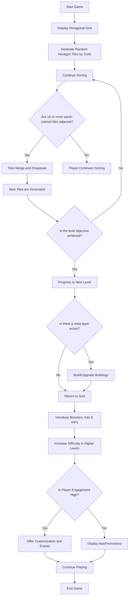
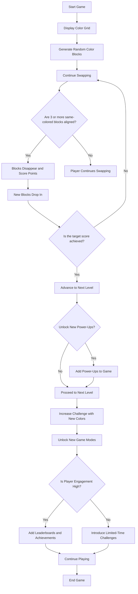
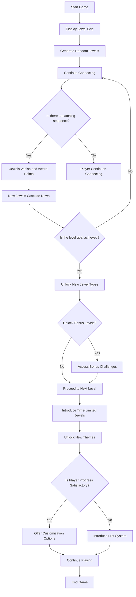
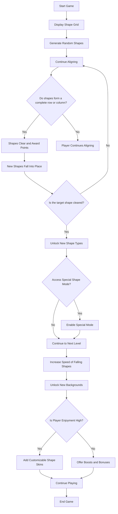

---
tags:
  - game design
title: Hexa Sort Game Analyze
author: Huy Nguyen
pubDatetime: 2024-09-02T11:20:00.737Z
slug: hexa-sort-game-analyze
featured: false
ogImage: https://avatars.mds.yandex.net/get-games/6238841/2a0000018dd12aed5b7bd426de200506e45a/orig
description: Flow chart of hexa sort
---
### 1.Gameplay

Hexa Sort is a hybrid-casual puzzle game where players arrange hexagonal tiles on a board by color. The core gameplay involves sorting tiles to create groups of ten or more adjacent same-colored tiles, which then merge and disappear, making room for new tiles. As players progress through levels, the game increases in difficulty by introducing more tile colors and altering the board's shape. The game features a meta layer where players can build and upgrade structures, adding a sense of progression.

Monetization is achieved through a blend of ads and in-app purchases, with a focus on rewarded video ads that players can engage with to unblock tiles or gain other benefits. The game also includes casual features like daily rewards, "Spin the Wheel" bonuses, and in-game events that help retain player engagement. Despite the relaxing and relatively unobtrusive gameplay experience, Hexa Sort lacks real social features, which could enhance its long-term viability. The game's popularity and success stem from its strategic blend of stacking and sorting mechanics, balanced level design, and engaging monetization strategy.

### 2.Flow

### 3. Color Match Puzzle (Similar Ideas)

### 4. Jewel Cascade (Similar Ideas)

### 5. Shape Shifter (Similar Ideas)
