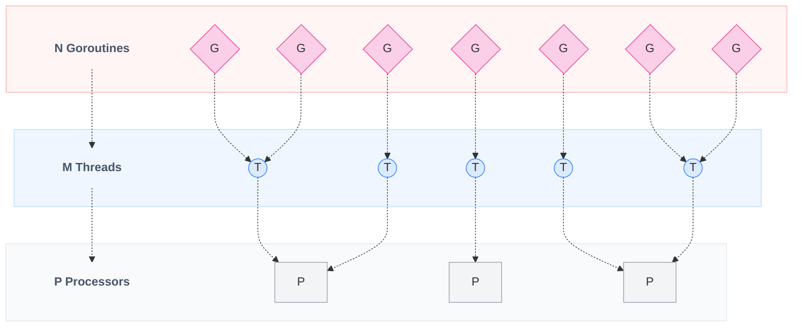
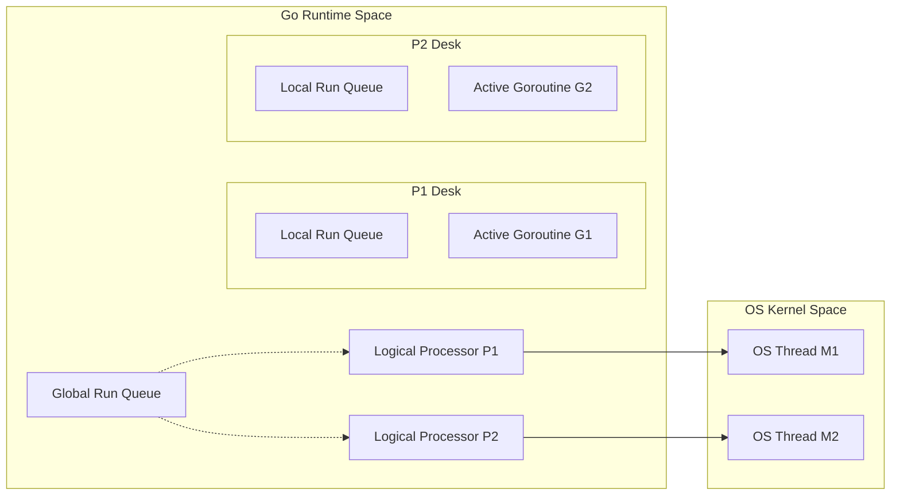
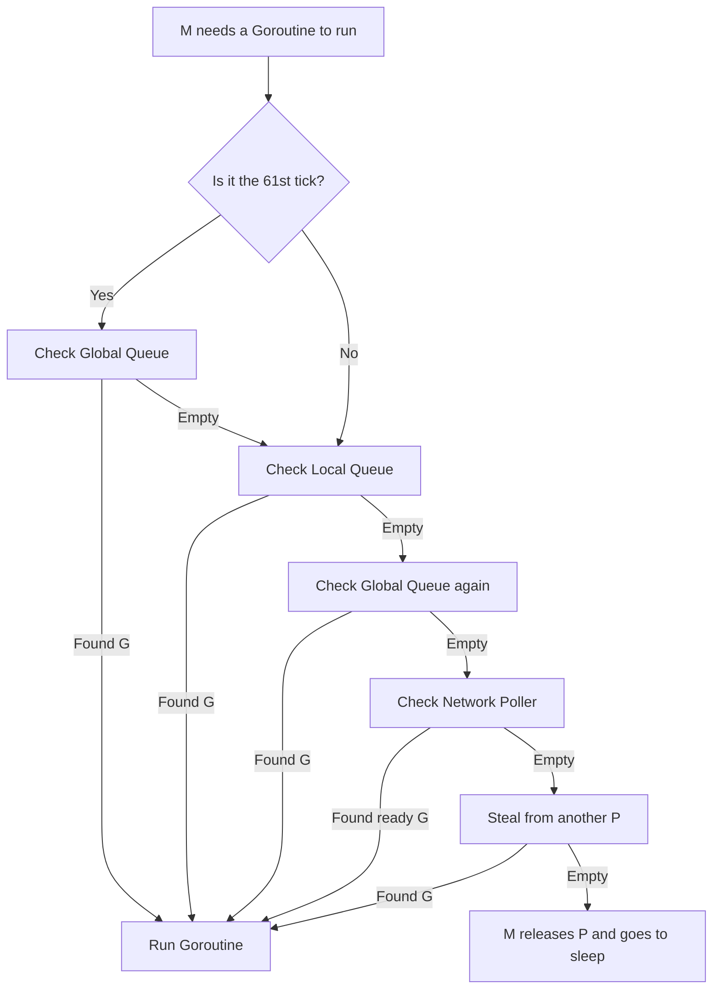
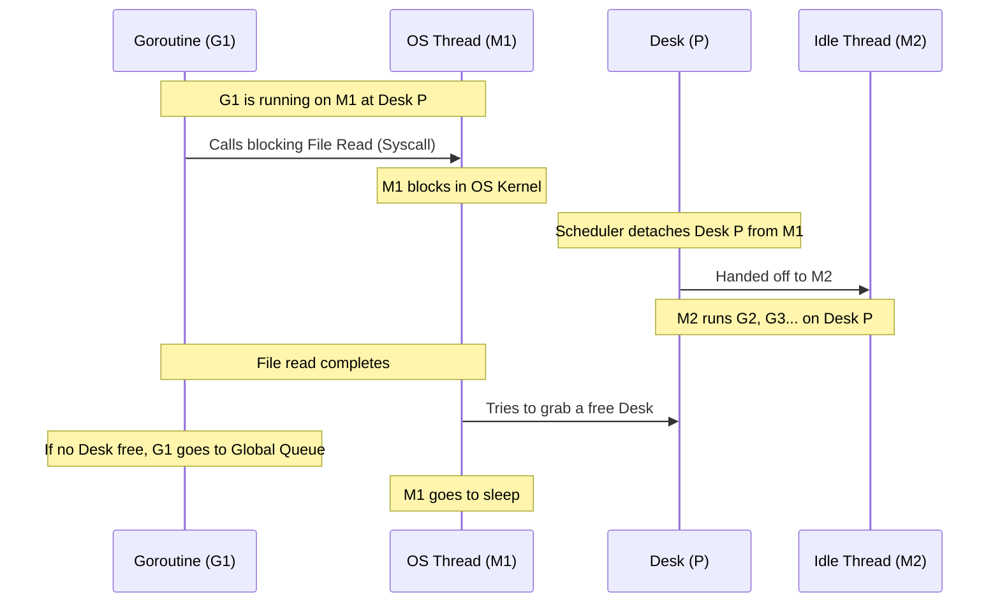

---
tags:
  - golang
  - concurrency
  - internals
  - scheduler
title: "Go's Scheduler: How the G-M-P Model Works"
author: Huy Nguyen
pubDatetime: 2026-06-14T02:50:00Z
slug: go-scheduler-gmp-model
featured: true
ogImage: /assets/go-scheduler-cover.png
description: "A simple, comprehensive guide to Go's runtime scheduler. Learn how the G-M-P model, work-stealing, and thread handoffs manage millions of concurrent tasks."
---

## Table of contents

---

Go is famous for its simple and powerful concurrency model. Using the `go` keyword, you can spawn thousands or even millions of concurrent tasks (called Goroutines) without breaking a sweat. 

But how does Go manage this under the hood? 

Historically, operating systems (OS) manage concurrency using heavy threads. Spawning millions of them would crash your system. To solve this, Go has its own lightweight scheduler that runs inside user space, using a design called the **G-M-P model**. 

Let's break down how it works using simple terms and official Go design concepts.

---

## The Core Problem: Why Are OS Threads Too Heavy?

In languages like Java or C++, applications typically map threads directly **1:1** to operating system (OS) threads. This is problematic for two main reasons:

1.  **Memory Footprint:** Each OS thread comes with a fixed-size stack of around 1MB to 2MB. Spawning 10,000 threads would require 10GB to 20GB of RAM just for their stacks.
2.  **Context Switching Cost:** When the CPU switches from running one thread to another, it has to save and load registers and memory states. This swap happens in kernel space and takes about 1,000 to 2,000 nanoseconds, which adds up fast.

Go uses an **M:N scheduler**. It maps **N** lightweight Goroutines onto **M** heavy OS threads. 

| Feature | OS Threads (1:1 Model) | Goroutines (M:N Model) |
| :--- | :--- | :--- |
| **Stack Size** | ~1MB - 2MB (Fixed size) | ~2KB (Grows & shrinks dynamically) |
| **Creation Cost** | High (Requires OS kernel allocation) | Very Low (User-space allocation) |
| **Switching Speed** | Slow (~1-2 μs, enters OS kernel) | Fast (~100-200 ns, stays in Go runtime) |
| **Managed By** | Operating System Kernel | Go Runtime Scheduler |

### The Evolution of Go Stacks: Solving the "Hot Split"

To make Goroutines so cheap, Go had to solve a major stack memory problem:

*   **Segmented Stacks (Pre-Go 1.3):** Early versions of Go allocated a new memory block and linked it to the old stack (like a linked list) when a Goroutine ran out of space. However, this caused the **"Hot Split"** (or stack thrashing) problem. If a loop repeatedly called a function right at the boundary of a segment, Go would constantly allocate and deallocate memory blocks, creating a severe performance bottleneck.
*   **Contiguous Stacks (Go 1.3+):** To fix this, Go changed to contiguous stacks. When a Goroutine runs out of stack space, the runtime allocates a new contiguous memory block that is **double the size**, copies the old stack's content into it, updates all internal pointers to the new addresses, and frees the old stack. This keeps stack memory contiguous and eliminates the hot split overhead.

---

## Meet the G-M-P Model

Go's scheduler uses three main components, represented by the letters **G**, **M**, and **P**. Think of them like workers in a factory:

*   **G (Goroutine / The Tasks):** The actual code you want to run (the total count is **N**). It starts with a tiny 2KB stack and contains its execution state.
*   **M (Machine / The Workers):** A physical OS thread (the total count is **M**). The workers do the actual CPU execution, but they cannot do anything without a desk (P).
*   **P (Processor / The Desks):** The logical resource or "context" needed to run Go code (the total count is **P**). Think of it as a worker's desk. The number of desks (Ps) is determined by `GOMAXPROCS` (which defaults to your CPU's core count).

### The Concurrency Formula: N >= M >= P

The relationship between the number of Goroutines (**N**), OS threads (**M**), and logical processors (**P**) is governed by the following formula:

<p align="center" style="font-size: 1.25em;">
  <strong>N (Goroutines) &ge; M (OS Threads) &ge; P (Logical Processors)</strong>
</p>



*   **N (Goroutines):** The user-space tasks. Since they are extremely cheap, you can spawn millions of them.
*   **M (OS Threads):** The physical system threads. Go creates them as needed (e.g. when threads block in system calls). While some are actively executing code, many are sleeping or idle in the pool.
*   **P (Logical Processors):** The hard limit on active execution. Only **P** threads can actively run Go code at any single moment. This is set by `GOMAXPROCS` (defaults to CPU core count).



### The Anatomy of a Context Switch: Registers & TLB Cache

Why is switching between Goroutines so much faster than OS threads? It comes down to what the CPU has to save at the hardware level:

*   **OS Thread Context Switch (Heavyweight):** The kernel has to save a massive CPU state, including 16 general-purpose registers, floating-point registers, AVX vector registers, segment registers, and CPU stack pointers. Crucially, the OS must also switch the memory page table. This invalidates the CPU's **Translation Lookaside Buffer (TLB)**, which causes severe cache misses and slows down execution.
*   **Goroutine Context Switch (Lightweight):** The Go scheduler runs in user space and only needs to save about **14 registers** (such as the Stack Pointer, Program Counter, and a few others). Since all Goroutines share the same memory space, there is no page table switch. The TLB remains warm, and the CPU cache stays highly efficient.

---

## How Go Schedules Work

Each desk (P) has a **Local Run Queue (LRQ)** containing up to 256 tasks (Gs) waiting to be run. There is also a shared **Global Run Queue (GRQ)** for any extra tasks.

When an OS thread (M) wants to work, it must sit at a desk (P) and look for a task (G) to run. It searches for tasks in this order:

1.  **Check Starvation (The 61-Tick Rule):** Every 61 scheduler iterations, P checks the Global Run Queue first. This ensures tasks in the global queue don't get ignored forever.
2.  **Check Local Run Queue:** M grabs a G from its own local queue.
3.  **Check Global Run Queue:** If the local queue is empty, M checks the shared global queue.
4.  **Check Network Poller:** M checks if there are any network requests that just finished.
5.  **Work Stealing:** If there is still no work, M goes to other desks (Ps) and steals half of their waiting tasks.



---

## Handling Blocks and Bottlenecks

What happens when a task gets stuck (e.g., waiting for a file to read, a network request, or a lock)? Go handles these blocks in two primary ways:

### 1. Network I/O (The Netpoller)
If a Goroutine blocks on a network request, Go doesn't block the OS thread (M). 
*   Instead, the Goroutine (G) is moved to the **Netpoller** (a subsystem that monitors network sockets).
*   The thread (M) remains at its desk (P) and immediately moves on to the next Goroutine in the local queue.
*   Once the network data arrives, the Netpoller moves the blocked Goroutine back to a run queue.

### 2. Blocking System Calls (Thread Handoff)
Some operations, like reading files from a hard drive, block the entire OS thread (M). In this case:
*   The active thread (M1) blocks in the kernel.
*   The Go runtime immediately detaches the desk (P) from the blocked thread (M1).
*   An idle thread (M2), or a newly spawned one, takes over the desk (P) and continues running the remaining tasks.
*   When the blocked thread (M1) finally finishes its file read, it tries to get a desk (P). If none are free, it puts the Goroutine (G1) in the Global Queue and goes to sleep in the idle pool.



---

## Preemption: Sharing CPU Time Fairly

What if a Goroutine is running a massive loop (e.g., `for { }`) and refuses to let other tasks run?

*   **Cooperative Preemption (Before Go 1.14):** Goroutines would only yield control at function calls. A tight loop without function calls could block a thread permanently, starving other tasks.
*   **Asynchronous Preemption (Go 1.14+):** A background monitoring thread (`sysmon`) keeps track of execution time. If a Goroutine runs for more than 10 milliseconds, the runtime sends a system signal (`SIGURG`) to the thread. The signal handler pauses the Goroutine, moves it back to the queue, and lets another task run.

---

## Best Practices for Developers

Now that you know how the scheduler works, you can write more efficient code:

1.  **Use `automaxprocs` in Docker:** By default, Go sets `GOMAXPROCS` to the number of host CPUs. In container environments (like Kubernetes), this can cause thread thrashing if your container is restricted to 1 or 2 CPU limits. Import `go.uber.org/automaxprocs` to automatically match container CPU limits.
2.  **Observe with `GODEBUG`:** You can print out the state of your scheduler in real-time by running your app with the `schedtrace` flag:
    ```bash
    $ GODEBUG=schedtrace=1000 ./my-app
    ```
    This prints statistics every 1000ms:
    ```text
    SCHED 1002ms: gomaxprocs=4 idleprocs=1 threads=6 spinningthreads=0 idlethreads=2 runqueue=1 [1 0 0 0]
    ```
    *   `runqueue=1`: One task in the Global Queue.
    *   `[1 0 0 0]`: Number of tasks waiting at each of the 4 desks (Ps).

---

## Conclusion

Go's scheduler is a masterpiece of systems engineering. By decoupling tasks (**G**) from physical threads (**M**) using logical desks (**P**), Go minimizes context switches and memory overhead. Understanding these internals helps you build high-performance, container-friendly applications.
