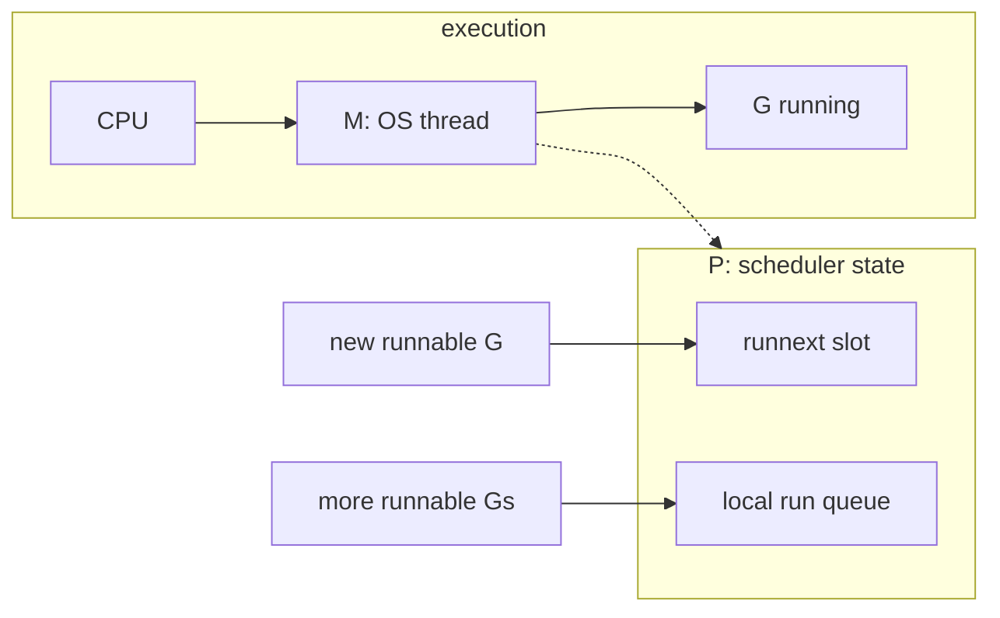
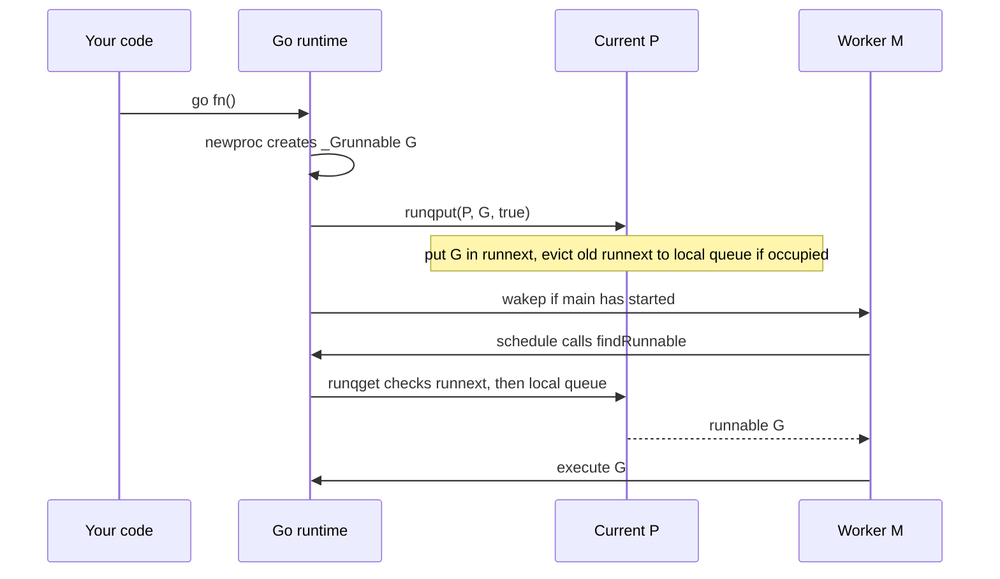
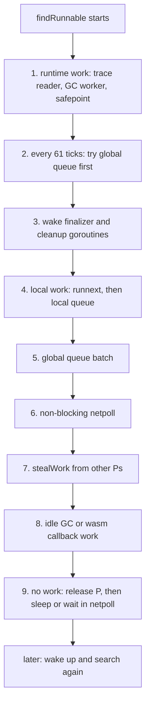
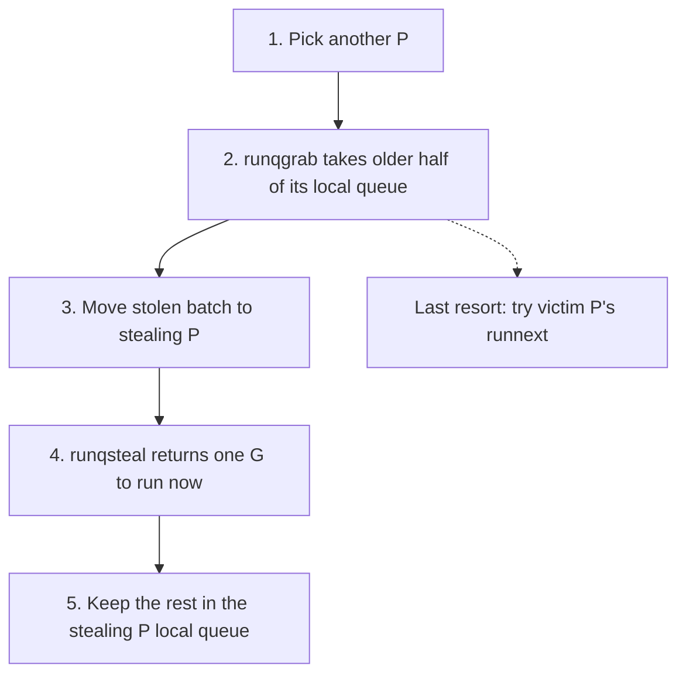
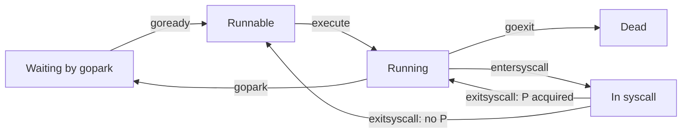
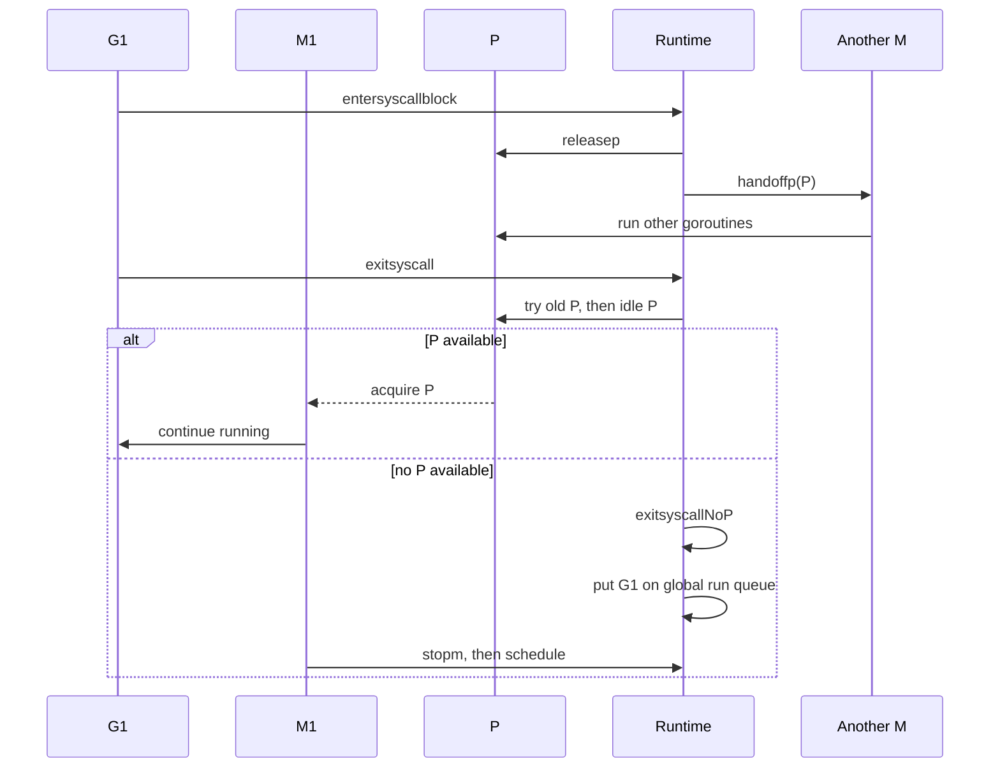

---
tags:
  - golang
  - concurrency
  - internals
  - scheduler
title: "Go's Scheduler: How the G-M-P Model Works"
author: Huy Nguyen
pubDatetime: 2026-06-14T02:50:00Z
slug: go-scheduler-gmp-model
featured: true
ogImage: /assets/go-scheduler-funny.png
description: "How Go schedules goroutines."
---

## Table of contents

---

Go makes concurrency look small:

```go
go sendEmail(userID)
```

That line creates a goroutine. A goroutine is not an operating system thread. It is a small unit of work managed by the Go runtime.

The scheduler's job is simple to say and hard to implement: keep runnable goroutines moving onto CPU time without creating one OS thread for every goroutine.

The current Go scheduler is built around three things:

- `G`: a goroutine, which is the work Go wants to run.
- `M`: an OS thread, called a machine in the runtime.
- `P`: a processor, which is the runtime resource an `M` needs before it can run Go code.

This is the G-M-P model.

---

## The Main Idea

An `M` runs code on a real OS thread, but it cannot run normal Go code unless it owns a `P`.

A `P` owns the scheduler state needed to run goroutines. The most important part is its local run queue: a small queue of runnable `G`s waiting for CPU time.

`GOMAXPROCS` controls how many `P`s exist. That means it controls how many OS threads can run Go code at the same time. The runtime may have more OS threads than `GOMAXPROCS`, but only threads with a `P` can execute Go code.



In a busy program, the shape often looks like this:

- many goroutines (`G`)
- fewer OS threads (`M`)
- a fixed number of processors (`P`)

So people often write it as `G >= M >= P`. That is a useful mental model, not a hard rule. The runtime can create extra `M`s when threads block in syscalls, and some `M`s can exist without a `P`.

The hard rule is this: an `M` needs a `P` to run Go code.

---

## What Happens When You Start a Goroutine

The compiler turns a `go` statement into a runtime call that creates a new `G`.

In `proc.go`, `newproc` creates that goroutine and calls `runqput(pp, newg, true)`. That means the runtime prioritizes the new goroutine by placing it directly in `runnext`. If that slot is already occupied, the existing goroutine in `runnext` is evicted and pushed to the current `P`'s local run queue (or to the global queue if the local queue is full) to make room. It also calls `wakep` so an idle thread can wake up if more execution capacity is needed.

The new goroutine does not run immediately just because you wrote `go`.

It becomes runnable:



A runnable goroutine waits until some `M` with a `P` picks it.

---

## How a P Chooses the Next Goroutine

The runtime function `schedule` asks `findRunnable` for work. That search is the heart of the scheduler.

The full path includes runtime work and normal goroutine work. In simple terms, `findRunnable` does this:

1. Check runtime work such as safe points, trace reader work, and GC worker work.
2. Check the global run queue once in a while.
3. Wake finalizer and cleanup goroutines if needed.
4. Check `runnext`, then the local run queue for the current `P`.
5. Check the global run queue again and move a batch to the local queue.
6. Poll the network poller without blocking.
7. Steal work from other `P`s.
8. Try idle GC or wasm callback work.
9. If there is still no work, release the `P`, recheck for missed work, then block in netpoll or stop the `M`.

The global queue is checked every 61 scheduler ticks before the local queue. This avoids a bad case where goroutines on one local queue keep creating more goroutines and global work waits too long.



Each search box returns immediately if it finds a goroutine to run. If none of them finds work, the `M` releases its `P`, sleeps or waits in netpoll, and later starts the search again.

The runtime also checks internal work such as tracing, GC workers, finalizers, cleanups, and timers. Those details matter inside the runtime, but the main user-level idea stays the same: the scheduler is always looking for a runnable `G`.

---

## Local Queues, Global Queue, and Runnext

Each `P` has:

- a local run queue with 256 slots
- a `runnext` slot for a goroutine that should run very soon
- access to the shared global run queue

When a new goroutine is created, the runtime usually tries to put it in `runnext` or the local queue of the current `P`. This keeps related work close together, which is good for CPU cache and reduces global lock use.

If the local queue is full, the runtime moves about half of that local queue plus the new goroutine to the global queue. This keeps one `P` from holding too much work.

When an `M` gets work from the global queue, it may take a batch and place the extra goroutines into its local queue. This reduces repeated locking on the global queue.

---

## Work Stealing

If a `P` has no local work and the global queue has no useful work, the `M` becomes a spinning worker and tries to steal from other `P`s.

Work stealing means:

1. Pick another `P`.
2. Look at that `P`'s local queue.
3. Steal about half of its local queue. In the code, `runqgrab` takes the older half.
4. Return one stolen goroutine to run now and keep the rest in the stealing `P`'s local queue.



The `runnext` slot is only stolen as a last resort, after normal local queue stealing does not find work.

This is why goroutines spread across available CPU time without a single central queue becoming the bottleneck.

The runtime also limits how many spinning `M`s exist. A spinning `M` uses CPU while looking for work, so too many spinning threads would waste power and make the program slower.

---

## When a Goroutine Waits

A goroutine does not always run until it finishes. It may wait or leave normal Go execution for:

- a channel send or receive
- a mutex
- a timer
- network I/O
- a syscall, which is tracked as `_Gsyscall`, not as a normal parked goroutine

When a goroutine waits inside the Go runtime, it is parked. Internally, `gopark` moves the current `G` from running to waiting, then the `M` goes back to the scheduler and looks for another runnable `G`.

Later, when the thing it waited for is ready, the runtime calls `goready`. That puts the goroutine back on a run queue so it can run again. Syscalls use a different path: `entersyscall` or `entersyscallblock` moves the goroutine to `_Gsyscall`, and `exitsyscall` brings it back.

The important point is that waiting usually blocks the goroutine, not the whole program.



The syscall path can return straight to `Running` if `exitsyscall` gets a `P`; otherwise `exitsyscallNoP` makes the goroutine runnable again.

---

## Network I/O

Network I/O is handled by the runtime netpoller.

If a goroutine waits for network data, the runtime can park that `G` and let the `M` keep using its `P` to run other goroutines. The OS notifies Go when the socket is ready. Then netpoll returns the ready goroutine list, and the runtime puts those goroutines back into scheduler queues.

That is why many goroutines can wait on network connections without needing one blocked OS thread per connection.

---

## Blocking Syscalls

Some calls can block the OS thread itself. File I/O and some cgo calls can behave this way.

When a goroutine enters a blocking syscall, the runtime must protect the `P`. If the blocked `M` kept the `P`, other goroutines waiting on that `P` could not run.

So the runtime hands the `P` to another `M`.



When the syscall returns, the old `M` tries to keep or get a `P` again. First it may still have its `P`. If not, it tries its old `P`, then an idle `P`. If that also fails, `exitsyscallNoP` changes the goroutine back to runnable, puts it on the global queue, and parks the `M`.

The `sysmon` thread also watches for long syscalls. If a `P` has been tied to a syscall for too long and there is work to do, `sysmon` can retake that `P` and hand it to another `M`.

---

## Preemption

A goroutine can also run for too long without blocking. The runtime needs a way to stop one goroutine from taking a `P` forever.

`sysmon` watches running `P`s. If the same scheduler tick runs for about 10 ms, the runtime asks that `P` to preempt the current goroutine.

Preemption is a request, not always an instant stop. The runtime sets preemption flags and, when supported, asks the OS thread to take an async preemption signal. Once the goroutine reaches a safe point, it is stopped, changed to a runnable state (`_Grunnable`), and is typically placed on the global run queue (or the local `P`'s `runnext` slot if preempted to cooperate with a pending Garbage Collector Stop-The-World request). This allows another goroutine to run.

This keeps CPU-bound goroutines from starving the rest of the program.

---

## A Full Example

Imagine this program:

```go
func main() {
    go readFromNetwork()
    go compressFile()
    go writeLog()

    select {}
}
```

Here is what the scheduler sees:

1. `main` creates three new `G`s.
2. Those `G`s are put on a local queue or `runnext`.
3. An `M` with a `P` picks one `G` and runs it.
4. If `readFromNetwork` waits on a socket, it parks and netpoll tracks the socket.
5. The same `M` can run `compressFile` or `writeLog`.
6. If `compressFile` uses CPU for too long, preemption can let another `G` run.
7. If `writeLog` enters a blocking syscall, its `M` may lose the `P` so another `M` can keep running Go code.
8. When network data or the syscall result is ready, that `G` becomes runnable again.

That is goroutine scheduling in practice: goroutines move between runnable, running, waiting, and done. `P`s hold the run queues and execution rights. `M`s are the OS threads that do the running.

---

## Mental Model

Keep this model in your head:

- A goroutine is work, not a thread.
- A runnable goroutine waits in a queue.
- An OS thread must own a `P` before it can run Go code.
- `GOMAXPROCS` controls how many `P`s can run Go code at once.
- Local queues make scheduling fast.
- The global queue keeps work shared.
- Work stealing balances busy and idle `P`s.
- Parking blocks a goroutine, not necessarily an OS thread.
- Blocking syscalls may block an OS thread, so the runtime hands the `P` away.
- Preemption stops long-running goroutines from taking a `P` forever.

The scheduler is not magic. It is a loop that keeps finding runnable goroutines and matching them with OS threads that are allowed to run Go code.

---

Source checked while editing: [`runtime/proc.go`](https://github.com/golang/go/blob/master/src/runtime/proc.go) in the Go repository.
