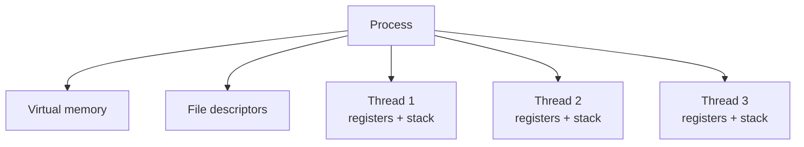
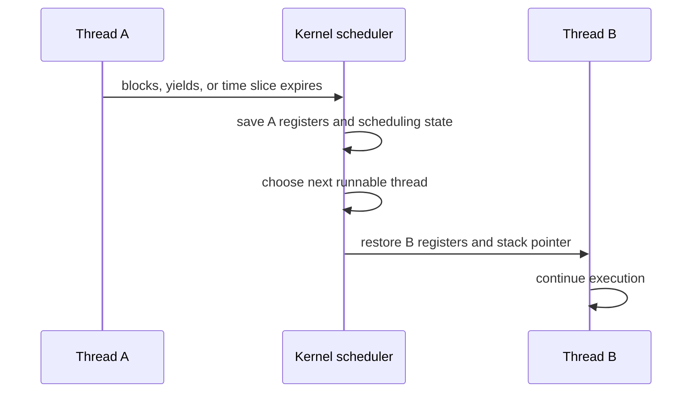
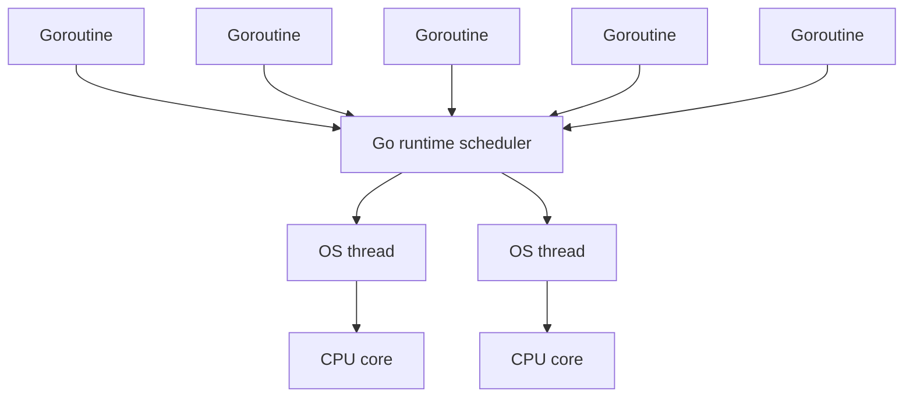
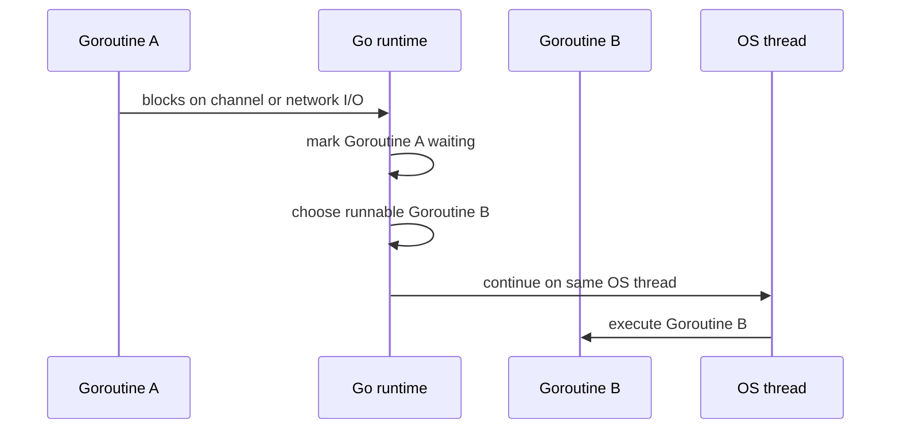

---
tags:
  - golang
  - concurrency
  - operating-system
  - internals
title: "OS Threads vs Goroutines: A Deep Dive"
author: Huy Nguyen
pubDatetime: 2026-06-18T03:00:00Z
slug: os-threads-vs-goroutines
featured: true
ogImage: /assets/go-scheduler-funny.png
description: "Deep dive into operating system threads, context switching cost, and why Go's goroutines are cheaper for highly concurrent programs."
---

## Table of contents

---

Concurrency sounds simple: let many pieces of work make progress at the same time.

The hard part is the execution model underneath it.

Traditional systems programming usually exposes concurrency through operating system threads. Go exposes concurrency through goroutines. Both can run code concurrently, but they are not the same abstraction, and they do not have the same cost model.

This post walks through:

- what an OS thread really is
- what happens during a context switch
- why too many thread switches can become expensive
- how goroutines reduce that cost
- where goroutines still have weaknesses

The numbers below are intentionally conservative and sourced:

- The current Go runtime source defines the minimum Go stack as `stackMin = 2048`, so a new goroutine starts with about 2 KiB of stack on common platforms before growing when needed: [Go runtime stack.go](https://go.dev/src/runtime/stack.go).
- The Go FAQ describes goroutine stacks as starting at "a few kilobytes" and growing and shrinking automatically: [Go FAQ: Why goroutines instead of threads?](https://go.dev/doc/faq#goroutines).
- On Linux with NPTL, the default pthread stack is controlled by `RLIMIT_STACK`. The Linux man page shows the common `ulimit -s` value `8192`, meaning an 8 MiB default stack for new pthreads: [pthread_create(3)](https://man7.org/linux/man-pages/man3/pthread_create.3.html).

That means a useful Linux comparison is:

| Unit | Typical starting stack |
| --- | ---: |
| Go goroutine | 2 KiB |
| Linux pthread when `ulimit -s` is `8192` | 8 MiB |

`8 MiB / 2 KiB = 4096`.

So, by initial stack size alone, one default Linux pthread stack is about 4096 times larger than one new goroutine stack. This is a stack-size comparison, not total memory usage. Real memory use also includes scheduler metadata, heap objects, guard pages, committed vs reserved memory, and what the function actually calls.

---

## What Is an OS Thread?

A process is a running program. It owns resources such as:

- virtual memory
- file descriptors
- signal handlers
- process credentials
- one or more threads

A thread is an execution unit inside a process. Each thread has its own:

- program counter, which says what instruction it is executing
- CPU registers
- stack
- scheduling state
- thread-local storage

Threads in the same process share the same address space. That is powerful because threads can communicate by reading and writing shared memory. It is also dangerous because shared memory introduces data races, deadlocks, and memory visibility problems when synchronization is wrong.



The operating system kernel schedules threads onto CPU cores. If a machine has 8 logical CPUs, the OS can physically run around 8 CPU-bound threads at the same instant. If there are 1,000 runnable threads, the OS gives each thread a slice of CPU time and repeatedly switches between them.

That switching is called a context switch.

---

## What Happens During a Context Switch?

A context switch happens when the CPU stops executing one thread and starts executing another.

Common reasons include:

- the current thread used its time slice
- the current thread blocks on I/O
- the current thread waits on a mutex, condition variable, semaphore, or futex
- a higher-priority thread becomes runnable
- an interrupt or kernel event causes the scheduler to run

At a high level, the OS must:

1. Save the current thread's CPU state.
2. Update scheduler data structures.
3. Pick another runnable thread.
4. Restore the next thread's CPU state.
5. Resume execution in the new thread.



The direct cost is kernel scheduler work and CPU state save/restore.

The indirect cost is often more important:

- CPU cache lines used by the old thread may no longer be useful.
- The new thread may touch different memory and cause cache misses.
- Translation lookaside buffer entries may become less useful, especially when switching between different processes.
- Branch predictor and CPU pipeline state may be less helpful for the new code path.
- Lock handoff between threads can move ownership across CPU cores, which causes cache coherence traffic.

A single context switch is not usually a problem. Millions of context switches per second can become a problem.

---

## A C Example: Baseline vs Thread Ping-Pong

To understand context switch cost, compare two cases:

1. `local`: one thread increments a local variable. There is no intentional application-level thread handoff.
2. `pingpong`: two POSIX threads pass control back and forth with a mutex and condition variable. Each step wakes one thread and blocks the other.

The `local` mode is not "zero context switches in the whole operating system". The OS can still interrupt the process. But it avoids the deliberate wake/sleep pattern caused by thread-to-thread coordination.

```c
#include <pthread.h>
#include <stdio.h>
#include <stdlib.h>
#include <string.h>
#include <sys/resource.h>
#include <time.h>

typedef struct {
    pthread_mutex_t mu;
    pthread_cond_t cv;
    int turn;
    int loops;
} state_t;

static long long now_ns(void) {
    struct timespec ts;
    clock_gettime(CLOCK_MONOTONIC, &ts);
    return (long long)ts.tv_sec * 1000000000LL + ts.tv_nsec;
}

static void read_switches(long *voluntary, long *involuntary) {
    struct rusage usage;
    getrusage(RUSAGE_SELF, &usage);
    *voluntary = usage.ru_nvcsw;
    *involuntary = usage.ru_nivcsw;
}

static void run_local(int loops) {
    volatile unsigned long long x = 0;
    long v0, iv0, v1, iv1;

    read_switches(&v0, &iv0);
    long long start = now_ns();

    for (int i = 0; i < loops * 2; i++) {
        x++;
    }

    long long elapsed = now_ns() - start;
    read_switches(&v1, &iv1);

    printf("mode: local\n");
    printf("operations: %d\n", loops * 2);
    printf("elapsed: %.3f ms\n", elapsed / 1000000.0);
    printf("average operation: %.1f ns\n", (double)elapsed / (loops * 2));
    printf("voluntary context switches: %ld\n", v1 - v0);
    printf("involuntary context switches: %ld\n", iv1 - iv0);
    printf("ignore: %llu\n", x);
}

static void *worker(void *arg) {
    state_t *s = (state_t *)arg;

    for (int i = 0; i < s->loops; i++) {
        pthread_mutex_lock(&s->mu);

        while (s->turn != 1) {
            pthread_cond_wait(&s->cv, &s->mu);
        }

        s->turn = 0;
        pthread_cond_signal(&s->cv);
        pthread_mutex_unlock(&s->mu);
    }

    return NULL;
}

static void run_pingpong(int loops) {
    state_t s = {
        .mu = PTHREAD_MUTEX_INITIALIZER,
        .cv = PTHREAD_COND_INITIALIZER,
        .turn = 0,
        .loops = loops,
    };

    pthread_t t;
    pthread_create(&t, NULL, worker, &s);

    long v0, iv0, v1, iv1;
    read_switches(&v0, &iv0);

    long long start = now_ns();

    for (int i = 0; i < loops; i++) {
        pthread_mutex_lock(&s.mu);

        while (s.turn != 0) {
            pthread_cond_wait(&s.cv, &s.mu);
        }

        s.turn = 1;
        pthread_cond_signal(&s.cv);
        pthread_mutex_unlock(&s.mu);
    }

    pthread_join(t, NULL);

    long long elapsed = now_ns() - start;
    long long handoffs = (long long)loops * 2;

    read_switches(&v1, &iv1);

    printf("mode: pingpong\n");
    printf("handoffs: %lld\n", handoffs);
    printf("elapsed: %.3f ms\n", elapsed / 1000000.0);
    printf("average handoff: %.1f ns\n", (double)elapsed / handoffs);
    printf("voluntary context switches: %ld\n", v1 - v0);
    printf("involuntary context switches: %ld\n", iv1 - iv0);
}

int main(int argc, char **argv) {
    if (argc != 3) {
        fprintf(stderr, "usage: %s local|pingpong loops\n", argv[0]);
        return 2;
    }

    int loops = atoi(argv[2]);

    if (strcmp(argv[1], "local") == 0) {
        run_local(loops);
        return 0;
    }

    if (strcmp(argv[1], "pingpong") == 0) {
        run_pingpong(loops);
        return 0;
    }

    fprintf(stderr, "unknown mode: %s\n", argv[1]);
    return 2;
}
```

Compile and run it:

```bash
cc -O2 -pthread thread_ping_pong.c -o thread_ping_pong

./thread_ping_pong local 1000000
./thread_ping_pong pingpong 1000000
```

You should expect the `pingpong` mode to be much slower per step and to report many more voluntary and/or involuntary context switches. The exact counter depends on the OS and scheduler path.

Do not treat `pingpong average handoff - local average operation` as the exact context switch cost. The number includes mutex work, condition variable work, kernel wakeups, scheduler behavior, CPU frequency behavior, and OS policy. But the difference shows why tiny pieces of work plus frequent thread handoff are expensive.

The lesson is the shape of the cost:

- If two threads do useful work for a long time, context switching cost is usually small compared with the work.
- If two threads constantly wake each other to do tiny pieces of work, scheduling overhead can dominate.
- If thousands of threads are runnable but only a few CPU cores exist, the OS spends more time deciding and switching.

---

## Why Too Many OS Threads Become Expensive

OS threads are powerful because the kernel knows about them directly. They work with blocking system calls, CPU scheduling, debuggers, profilers, and hardware.

But they are relatively heavy as a unit of concurrency.

### Memory Cost

Each OS thread needs a stack. The reserved stack size is often much larger than the thread actually uses.

On Linux with NPTL, the default pthread stack follows `RLIMIT_STACK` when that limit is not unlimited. A very common value is:

```bash
ulimit -s
8192
```

That means 8192 KiB, or 8 MiB.

Now compare the starting stack size:

| Concurrent tasks | Linux pthread stack at 8 MiB each | Go goroutine stack at 2 KiB each |
| ---: | ---: | ---: |
| 1,000 | about 8 GiB | about 2 MiB |
| 10,000 | about 80 GiB | about 20 MiB |
| 100,000 | about 800 GiB | about 200 MiB |

This table is intentionally only comparing starting/reserved stack size. The OS may reserve address space before committing physical memory, and goroutines also have runtime metadata. But the ratio explains why thread-per-connection designs hit limits much earlier.

### Scheduler Cost

The kernel scheduler must track runnable threads. When the number of runnable threads grows far beyond CPU cores, the scheduler must choose among many candidates.

More runnable threads also means:

- more preemption
- more cache churn
- more lock contention
- more CPU time spent outside application logic

### Blocking Cost

Blocking is natural with OS threads:

```c
read(fd, buffer, size);
```

If the file descriptor is not ready, the thread sleeps. Sleeping is fine. The problem appears when the program needs many independent blocking operations. A thread-per-operation design can create a huge number of OS threads, most of them idle, all of them carrying stack and scheduling overhead.

---

## What Is a Goroutine?

A goroutine is a lightweight execution unit managed by the Go runtime.

The current Go runtime defines the minimum Go stack as `2048` bytes. On common platforms, a new goroutine starts with a small stack around 2 KiB, then the runtime grows it when the goroutine needs deeper call frames.

You create one with the `go` keyword:

```go
go sendEmail(userID)
```

That does not create a new OS thread for every call. It creates a goroutine, and the Go runtime schedules many goroutines onto a smaller number of OS threads.

This is often called M:N scheduling:

- M goroutines
- N OS threads
- the Go runtime maps goroutines onto threads



In the Go runtime, this is implemented through the G-M-P model:

- `G`: a goroutine
- `M`: an OS thread
- `P`: a processor, the runtime resource needed to execute Go code

`GOMAXPROCS` controls how many `P`s can run Go code at the same time. If `GOMAXPROCS=8`, up to 8 OS threads can execute Go code in parallel, even if the program has hundreds of thousands of goroutines.

---

## What Problem Are Goroutines Solving?

Goroutines solve a practical server-side problem:

How can we write code in a simple blocking style, while supporting a very large number of concurrent tasks?

Without goroutines, traditional thread-based systems usually force a tradeoff between simple code and scalable resource usage.

### Problem 1: Thread Per Connection Is Simple but Expensive

In C with POSIX threads, the most direct server model is one thread per connection:

```c
static void *handle_client(void *arg) {
    int fd = *(int *)arg;
    free(arg);

    char buf[4096];
    for (;;) {
        ssize_t n = read(fd, buf, sizeof(buf));
        if (n <= 0) {
            close(fd);
            return NULL;
        }

        process_request_bytes(buf, n);
    }
}

for (;;) {
    int fd = accept(listener_fd, NULL, NULL);
    if (fd < 0) {
        continue;
    }

    int *arg = malloc(sizeof(*arg));
    *arg = fd;

    pthread_t tid;
    pthread_create(&tid, NULL, handle_client, arg);
    pthread_detach(tid);
}
```

This code is easy to read because `read` blocks naturally. The function says exactly what happens to one connection.

The cost is hidden in the execution model:

- If there are 10,000 connections, there can be 10,000 OS threads.
- With an 8 MiB default Linux pthread stack, 10,000 threads imply about 80 GiB of stack address space.
- Most of those threads may be doing nothing except waiting in `read`.
- When many become runnable, the kernel has to schedule many threads even if the machine has only 8 or 16 logical CPUs.

The thread-per-connection model is clear, but the unit of concurrency is too heavy for very high fan-out I/O servers.

### Problem 2: Thread Pools Avoid Thread Explosion but Add Queueing

A common fix is a bounded thread pool:

```text
connection/request -> queue -> fixed worker threads -> blocking code
```

This protects the process from creating unlimited threads. But it changes the problem:

- If all workers block on slow I/O, queued work waits even when the CPU is idle.
- The pool size becomes a tuning problem.
- Too small means poor concurrency.
- Too large moves back toward thread explosion.
- Cancellation and request lifetime must be tracked outside the simple call stack.

Thread pools are useful, but they make "number of concurrent tasks" and "number of OS threads" too tightly connected.

This is not only a C problem. Any runtime built around native threads or fixed executor pools has to deal with the same shape of issue: a blocking operation occupies a worker thread, each native thread has stack cost, and the pool size becomes a capacity limit. Different languages hide different parts of this, but they cannot make OS threads free.

### Problem 3: Event Loops Scale but Make Blocking Dangerous

Another fix is an event loop:

```text
connection -> nonblocking fd -> epoll/kqueue/IOCP -> callback/state machine
```

In C, this usually means `epoll` on Linux, `kqueue` on BSD/macOS, or IOCP on Windows. It can scale to many connections with a small number of OS threads.

But the application code becomes harder:

- Every file descriptor must be nonblocking.
- A single blocking call can stall the event loop.
- The state of one request is split across callbacks or manual state machines.
- Error handling and cancellation often spread across many branches.
- CPU-heavy work still has to be moved to a separate worker pool.

Event loops are powerful, but they push scheduling complexity into application code.

### What Go Changes

Go keeps the simple blocking style but changes the unit that blocks.

The programmer writes one goroutine per connection:

```go
func handle(conn net.Conn) {
    defer conn.Close()

    buf := make([]byte, 4096)
    for {
        n, err := conn.Read(buf)
        if err != nil {
            return
        }

        process(buf[:n])
    }
}

func serve(listener net.Listener) error {
    for {
        conn, err := listener.Accept()
        if err != nil {
            return err
        }

        go handle(conn)
    }
}
```

This code looks like the C thread-per-connection version, but the cost model is closer to an evented runtime:

- `conn.Read` can park the goroutine.
- The runtime's network poller waits for readiness.
- The OS thread can run other goroutines while this connection is waiting.
- The goroutine keeps a normal call stack, so the code stays direct.
- The runtime multiplexes many blocked goroutines over fewer OS threads.

That is the main change: Go decouples "number of concurrent tasks" from "number of kernel threads".

In C pthread style:

```text
10,000 mostly idle connections -> roughly 10,000 OS threads
```

In Go style:

```text
10,000 mostly idle connections -> roughly 10,000 goroutines -> much smaller OS thread set
```

This is why goroutines make highly concurrent server code feel different. They let you write blocking-looking code without paying one OS thread stack and one kernel-scheduled thread per task.

---

## Goroutine Context Switching

An OS thread context switch is managed by the kernel.

A goroutine switch is usually managed by the Go runtime in user space.

When a goroutine blocks on a channel, mutex, timer, or network poller event, the runtime can park it and run another goroutine. In many cases, this does not require entering the kernel scheduler to switch from one OS thread to another.



This is cheaper because the runtime mostly switches between goroutine stacks and scheduler metadata. The OS thread can remain the same.

It is not free. The runtime still does work. But it is much cheaper than needing one kernel-scheduled thread per concurrent task.

---

## Stack Size: Thread Stack vs Goroutine Stack

Thread stacks are typically large reservations. Goroutine stacks start small and grow when needed.

That difference matters for high concurrency.

Using the verified numbers above:

- one new goroutine stack: about 2 KiB
- one common Linux pthread default stack: about 8 MiB
- ratio: `8 MiB / 2 KiB = 4096`

If a program has 100,000 concurrent tasks:

- 100,000 Linux pthreads at 8 MiB each imply about 800 GiB of stack address space.
- 100,000 goroutines at 2 KiB each start at about 200 MiB of stack memory before growth.

The goroutine number is not a promise that the whole program uses only 200 MiB. Real goroutines also allocate heap objects, hold references, and have scheduler metadata. Some stacks grow beyond 2 KiB. But the starting point is small enough that one goroutine per connection, request, or independent task becomes practical.

---

## Practical Comparison

| Area | OS threads | Goroutines |
| --- | --- | --- |
| Managed by | Operating system kernel | Go runtime |
| Scheduling model | Kernel schedules threads onto CPUs | Go schedules goroutines onto OS threads |
| Stack | Common Linux pthread default can be 8 MiB when `ulimit -s` is `8192` | Starts around 2 KiB on common platforms and grows |
| Creation cost | Relatively expensive | Cheap |
| Switching cost | Kernel context switch | Often user-space runtime switch |
| Blocking I/O | Blocks the thread | Often parks only the goroutine |
| Parallel CPU execution | Yes | Yes, up to `GOMAXPROCS` running Go code at once |
| Best fit | CPU-bound work, system integration, lower-level control | Many concurrent tasks, I/O-heavy servers, simple concurrent code |

The key point is not "goroutines are faster than threads" in every possible benchmark.

The key point is that goroutines are a better unit of concurrency for many application-level tasks. You can create many more goroutines than OS threads and let the runtime multiplex them efficiently.

---

## Example: Many Concurrent Tasks in Go

This example starts many goroutines that wait on timers. Creating this many OS threads would be much more expensive.

```go
package main

import (
    "fmt"
    "sync"
    "time"
)

func main() {
    const n = 100000

    var wg sync.WaitGroup
    wg.Add(n)

    start := time.Now()

    for i := 0; i < n; i++ {
        go func(id int) {
            defer wg.Done()
            time.Sleep(100 * time.Millisecond)
            if id == 0 {
                fmt.Println("one goroutine finished")
            }
        }(i)
    }

    wg.Wait()

    fmt.Println("elapsed:", time.Since(start))
}
```

The important detail is that `time.Sleep` parks the goroutine. The runtime does not need 100,000 OS threads sleeping in the kernel.

---

## Why Goroutines Are Good

Goroutines are good because they reduce the cost of expressing concurrency.

### They Make Concurrent Code Look Sequential

You can write:

```go
resp, err := http.Get(url)
```

inside a goroutine and let it block naturally. The runtime can park that goroutine while the network operation waits.

This is easier to read than manually splitting the logic into callbacks or state machines.

### They Are Cheap Enough to Use Freely

You still should not create goroutines without thinking, but they are cheap enough that common patterns become natural:

- one goroutine per request
- worker pools
- fan-out and fan-in
- background cleanup tasks
- pipeline stages

### They Compose With Channels and Synchronization

Goroutines are only one part of the model. Channels, mutexes, wait groups, contexts, and the runtime network poller complete the story.

Good Go concurrency is not "start goroutines everywhere". It is structuring work so goroutines have clear ownership, cancellation, and communication.

---

## Goroutines Still Have Weaknesses

Goroutines are lightweight, not magic.

### Goroutine Leaks

Bad code:

```go
func waitForValue(ch <-chan int) {
    go func() {
        value := <-ch
        fmt.Println(value)
    }()
}
```

What makes this bad:

- If nobody sends on `ch`, the goroutine waits forever.
- The goroutine's stack, references, and runtime metadata stay alive.
- If this happens per request, the process slowly accumulates parked goroutines.

Correct code:

```go
func waitForValue(ctx context.Context, ch <-chan int) {
    go func() {
        select {
        case value := <-ch:
            fmt.Println(value)
        case <-ctx.Done():
            return
        }
    }()
}
```

The corrected version gives the goroutine an exit path when the caller no longer cares.

Extra bad code: return after the first result.

```go
type SearchResult struct {
    Source string
    Data   []byte
}

func searchFastest(queries []string) SearchResult {
    results := make(chan SearchResult)

    for _, query := range queries {
        query := query
        go func() {
            result := searchRemoteService(query)
            results <- result
        }()
    }

    return <-results
}
```

What makes this bad:

- The function returns after receiving the first result.
- Every slower goroutine later blocks forever at `results <- result` because nobody is receiving anymore.
- Each blocked goroutine keeps its stack, closure data, and `result` alive.
- If `SearchResult.Data` contains a large byte slice, this becomes both a goroutine leak and a memory retention bug.
- If this runs per HTTP request, leaked goroutines and retained byte slices can grow until the process becomes slow or runs out of memory.

Correct code:

```go
type SearchResult struct {
    Source string
    Data   []byte
}

func searchFastest(ctx context.Context, queries []string) (SearchResult, error) {
    ctx, cancel := context.WithCancel(ctx)
    defer cancel()

    results := make(chan SearchResult, len(queries))

    var wg sync.WaitGroup
    wg.Add(len(queries))

    for _, query := range queries {
        query := query
        go func() {
            defer wg.Done()

            result, err := searchRemoteServiceWithContext(ctx, query)
            if err != nil {
                return
            }

            select {
            case results <- result:
            case <-ctx.Done():
            }
        }()
    }

    go func() {
        wg.Wait()
        close(results)
    }()

    select {
    case result, ok := <-results:
        if !ok {
            return SearchResult{}, errors.New("no result")
        }
        cancel()
        return result, nil
    case <-ctx.Done():
        return SearchResult{}, ctx.Err()
    }
}
```

Why this version is better:

- `context.WithCancel` tells slower searches to stop after the first successful result.
- `searchRemoteServiceWithContext` must actually honor the context for cancellation to be effective.
- The buffered channel prevents a completed search from blocking forever if the caller returns.
- The `select` around the send gives each goroutine an exit path when cancellation wins.
- Closing `results` after `wg.Wait()` makes the "no result" case explicit.

### Too Many Runnable Goroutines

Many parked goroutines are usually fine.

Many runnable CPU-bound goroutines are different.

Bad code:

```go
func isPrime(n uint64) bool {
    if n < 2 {
        return false
    }
    for d := uint64(2); d*d <= n; d++ {
        if n%d == 0 {
            return false
        }
    }
    return true
}

func countPrimesBad(numbers []uint64) int64 {
    var count atomic.Int64
    var wg sync.WaitGroup
    wg.Add(len(numbers))

    for _, n := range numbers {
        n := n
        go func() {
            defer wg.Done()

            if isPrime(n) {
                count.Add(1)
            }
        }()
    }

    wg.Wait()
    return count.Load()
}
```

What makes this bad:

- If `numbers` has 100,000 elements, this creates 100,000 runnable goroutines.
- On an 8-core machine, only about 8 goroutines can execute Go code at the same time when `GOMAXPROCS=8`.
- The rest sit in run queues and add scheduling overhead.
- The atomic counter is safe, but it does not fix the scheduling problem.
- CPU-bound work usually needs bounded parallelism, not one goroutine per number.

Correct code:

```go
func countPrimesBounded(numbers []uint64) int64 {
    workers := runtime.GOMAXPROCS(0)
    jobs := make(chan uint64)
    results := make(chan int64, workers)

    var wg sync.WaitGroup
    wg.Add(workers)

    for i := 0; i < workers; i++ {
        go func() {
            defer wg.Done()

            var localCount int64
            for n := range jobs {
                if isPrime(n) {
                    localCount++
                }
            }

            results <- localCount
        }()
    }

    for _, n := range numbers {
        jobs <- n
    }
    close(jobs)

    wg.Wait()
    close(results)

    var total int64
    for partial := range results {
        total += partial
    }

    return total
}
```

The corrected version still processes every value in `numbers`, but only `runtime.GOMAXPROCS(0)` worker goroutines run the CPU-heavy prime checks. The `jobs` channel is directly connected to the input: each number is sent once, processed once, and counted through per-worker local totals.

### Blocking Syscalls and Cgo

The Go runtime handles many blocking operations well, especially network I/O through the runtime poller.

Bad code:

```go
/*
#include <unistd.h>

void slow_native_call(void) {
    sleep(10);
}
*/
import "C"

func callNativeForEveryRequest(requests []Request) {
    var wg sync.WaitGroup
    wg.Add(len(requests))

    for range requests {
        go func() {
            defer wg.Done()
            C.slow_native_call()
        }()
    }

    wg.Wait()
}
```

What makes this bad:

- Each cgo call can occupy an OS thread while it is inside C.
- If many calls block for a long time, the runtime may need more OS threads.
- The goroutines are cheap, but the native blocking work behind them is not.
- Context cancellation cannot automatically interrupt arbitrary C code that is already running.

Correct code:

```go
func callNativeWithLimit(ctx context.Context, requests []Request) error {
    const maxNativeCalls = 8

    sem := make(chan struct{}, maxNativeCalls)

    var wg sync.WaitGroup
    for range requests {
        select {
        case sem <- struct{}{}:
        case <-ctx.Done():
            return ctx.Err()
        }

        wg.Add(1)
        go func() {
            defer wg.Done()
            defer func() { <-sem }()

            C.slow_native_call()
        }()
    }

    done := make(chan struct{})
    go func() {
        wg.Wait()
        close(done)
    }()

    select {
    case <-done:
        return nil
    case <-ctx.Done():
        return ctx.Err()
    }
}
```

The corrected version limits how many OS threads can be tied up in the native call at once. If the native library supports cancellation or timeouts, pass those into the native layer too. A Go `context.Context` can stop launching more work, but it cannot magically stop arbitrary C code already executing.

### Data Races Are Still Possible

Bad code:

```go
var count int
var wg sync.WaitGroup

for i := 0; i < 1000; i++ {
    wg.Add(1)
    go func() {
        defer wg.Done()
        count++
    }()
}

wg.Wait()
fmt.Println(count)
```

What makes this bad:

- `count++` is a read-modify-write operation, not one atomic operation.
- Multiple goroutines can read the same old value and overwrite each other.
- The final count may be lower than 1000.
- The race detector should report this as a data race.

Correct code:

```go
var count atomic.Int64
var wg sync.WaitGroup

for i := 0; i < 1000; i++ {
    wg.Add(1)
    go func() {
        defer wg.Done()
        count.Add(1)
    }()
}

wg.Wait()
fmt.Println(count.Load())
```

Run tests with the race detector when shared state is involved:

```bash
go test -race ./...
```

### Channels Can Become Bottlenecks

Bad code:

```go
func countEvents(events []Event) int {
    counts := make(chan int)

    for _, event := range events {
        event := event
        go func() {
            if isInteresting(event) {
                counts <- 1
                return
            }
            counts <- 0
        }()
    }

    total := 0
    for range events {
        total += <-counts
    }

    return total
}
```

What makes this bad:

- It creates one goroutine per event.
- Every goroutine contends on the same channel.
- If `isInteresting` is cheap, channel synchronization can cost more than the work.
- The channel is being used as a global counter, not as a clear ownership boundary.

Correct code:

```go
func countEvents(events []Event) int {
    workers := runtime.GOMAXPROCS(0)
    chunkSize := (len(events) + workers - 1) / workers

    partials := make([]int, workers)

    var wg sync.WaitGroup
    for worker := 0; worker < workers; worker++ {
        start := worker * chunkSize
        end := min(start+chunkSize, len(events))
        if start >= end {
            continue
        }

        wg.Add(1)
        go func(worker, start, end int) {
            defer wg.Done()

            local := 0
            for _, event := range events[start:end] {
                if isInteresting(event) {
                    local++
                }
            }
            partials[worker] = local
        }(worker, start, end)
    }

    wg.Wait()

    total := 0
    for _, partial := range partials {
        total += partial
    }
    return total
}
```

The corrected version batches work and writes one result per worker. Sometimes a channel is perfect. Sometimes a local variable plus one final merge is simpler and faster.

Note: `min` is available in modern Go. If you are on an older Go version, replace it with a small helper.

### Scheduler Latency Still Exists

The Go scheduler is efficient, but a goroutine is not guaranteed to run immediately after becoming runnable.

Bad code:

```go
func handleRequest(w http.ResponseWriter, r *http.Request) {
    done := make(chan struct{})

    for i := 0; i < 100000; i++ {
        go func(i int) {
            cpuHeavyStep(i)
            done <- struct{}{}
        }(i)
    }

    for i := 0; i < 100000; i++ {
        <-done
    }

    w.WriteHeader(http.StatusNoContent)
}
```

What makes this bad:

- One request can create 100,000 runnable CPU-bound goroutines.
- Other requests compete with this burst for scheduler time.
- A goroutine becoming runnable does not mean it runs immediately.
- Tail latency can increase even if total throughput looks acceptable.

Correct code:

```go
func handleRequest(w http.ResponseWriter, r *http.Request) {
    ctx := r.Context()

    workers := runtime.GOMAXPROCS(0)
    jobs := make(chan int)
    errCh := make(chan error, 1)

    var wg sync.WaitGroup
    wg.Add(workers)

    for i := 0; i < workers; i++ {
        go func() {
            defer wg.Done()
            for job := range jobs {
                if err := cpuHeavyStepWithContext(ctx, job); err != nil {
                    select {
                    case errCh <- err:
                    default:
                    }
                    return
                }
            }
        }()
    }

    for i := 0; i < 100000; i++ {
        select {
        case jobs <- i:
        case <-ctx.Done():
            close(jobs)
            wg.Wait()
            http.Error(w, ctx.Err().Error(), http.StatusRequestTimeout)
            return
        case err := <-errCh:
            close(jobs)
            wg.Wait()
            http.Error(w, err.Error(), http.StatusInternalServerError)
            return
        }
    }

    close(jobs)
    wg.Wait()

    select {
    case err := <-errCh:
        http.Error(w, err.Error(), http.StatusInternalServerError)
        return
    default:
    }

    w.WriteHeader(http.StatusNoContent)
}
```

The corrected version bounds CPU work, respects request cancellation, and avoids flooding the scheduler with far more runnable work than CPU cores can execute.

For latency-sensitive systems, measure with real workloads and use tools such as:

```bash
go test -bench=.
go test -run=NONE -bench=. -trace trace.out
go tool trace trace.out
go tool pprof cpu.pprof
```

---

## Mental Model

Use this model:

- OS threads are the kernel's execution units.
- Goroutines are Go's application-level execution units.
- The Go runtime multiplexes many goroutines onto fewer OS threads.
- Goroutine switching is often cheaper because it can happen in user space.
- Goroutines are excellent for many concurrent I/O-heavy tasks.
- CPU-bound work still depends on CPU cores.
- Leaks, races, blocking native calls, and unbounded concurrency can still hurt you.

Goroutines make concurrency cheaper and easier to express. They do not remove the need to understand scheduling, blocking, synchronization, and backpressure.
